# Lab Report

## 1. Inspect the data

Upload data

```
wget http://ftp.sra.ebi.ac.uk/vol1/fastq/SRR170/001/SRR1705851/SRR1705851.fastq.gz 
```

Download reference genome
```
efetch -db nucleotide -id KF848938.1 -format fasta > KF848938.1.fasta
```


Check the first few lines of the FASTQ file
```
head -10 SRR1705851.fastq
@SRR1705851.1 1/1
TTCGTGATTGTTTTCACTATCGTTCCGTTTGGCACTGCATGGTGCCCAAGGCACAGCGTTGCCGTGCTGTTGTCATTTCCAGGAAGTTTTTGAGCGAAAACCAGACATAGAATGTAGCTCAAAGCAATGATAGTCTTCATGGTTAATAG
+
,<==<<<<A@@@@
@@@EEE;CEE+AC>EC;>EFFDC@=A@AE999DDD>>@E777EE75C>EF>EDEEFFFF--AE>EDEEEED=C-58AE=<D=<<DD=D9CDD@EEDED@DEDDE*9;@DDED@@@7@E*;*888@*8;@8@;;@@E
@SRR1705851.2 2/1
NATTAACCATGAAGACTATCATTGCTTTGAGCTACATTCTATGTCTGGTTTTCGCTCAAAAACTTCCTGGAAATGACAACAGCACGGCAACGCTGTGCCTTGGGCACCATGCAGTGCCAAACGGAACGATAGTGAAAACAATCACGAATGA
+
#5<???BBEEEDEDDDGGGGGGIIIIIIIIIIIIIIIIIIIIIHIIIIFHHIIHHHHHIIIIHIIIIIIIHIIIIIIIIIIIIIIHHHHHHHHHHEHHHHHFFHHHHHHFFHHGFGGGGGGGGGGGGGEEEGCEEGGGGGEEGGGGCGEGG
@SRR1705851.3 3/1
GTTTGGCACTGCATGGTGCCCAAGGCACAGCGTTGCCGTGCTGTTGTCATTTCCAGGAAGTTTTTGAGCGAAAACCAGACATAGAATGTAGCTCAAAGCAATGATAGTCTTCATGGTTAATAG
```

Get summary statistics of the FASTQ file
```
seqkit stats SRR1705851.fastq
file              format  type  num_seqs     sum_len  min_len  avg_len  max_len
SRR1705851.fastq  FASTQ   DNA    358,265  52,717,864       35    147.1      151
```
## 2. Align data to the reference sequence

To align data we need to trim data.

Built fastqc report
```
fastqc -o . SRR1705851.fastq 
```

Inpect problematic parameters in report
<br/>
**Basic Statistics**

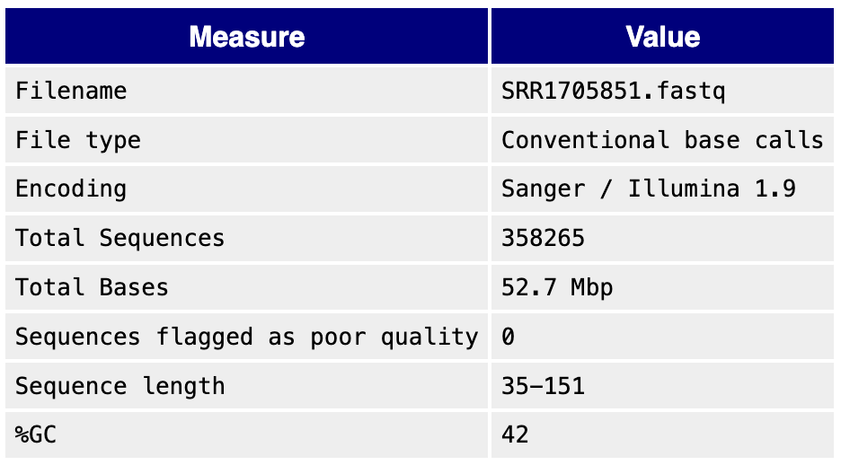
<br/>
**Per base sequence quality**

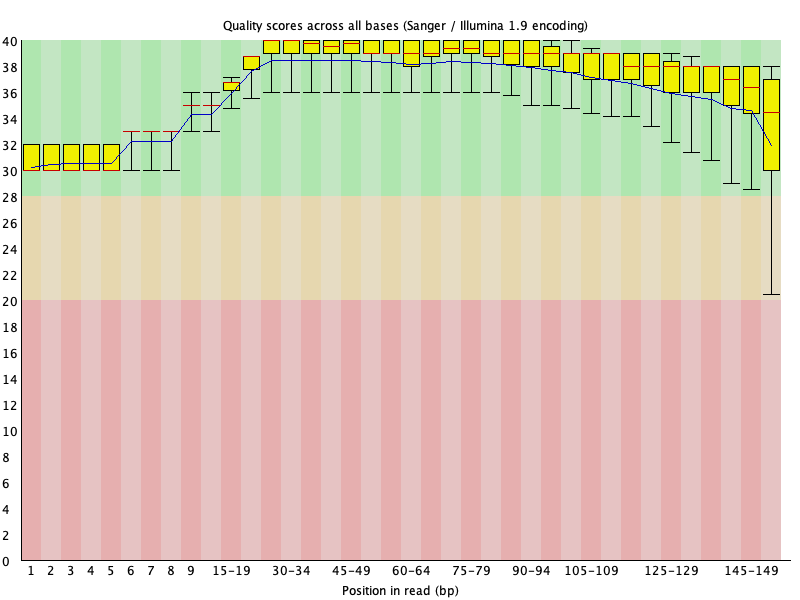
<br/>
**Per base sequence content**

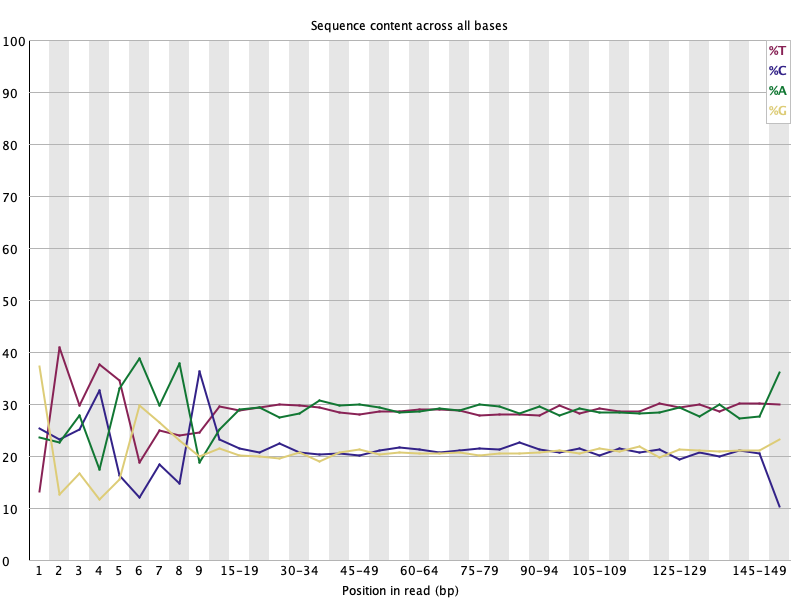

Since we have Sanger / Illumina 1.9, we select phred33 encoding.
Trim the FASTQ file to remove low-quality sequences (\< 20)
```
trimmomatic SE -phred33 SRR1705851.fastq SRR1705851_cut LEADING:20 TRAILING:20 MINLEN:20 HEADCROP:10

TrimmomaticSE: Started with arguments:
 -phred33 SRR1705851.fastq SRR1705851_cut LEADING:20 TRAILING:20 MINLEN:20 HEADCROP:10
Automatically using 4 threads
Input Reads: 358265 Surviving: 358265 (100,00%) Dropped: 0 (0,00%)
TrimmomaticSE: Completed successfully
```
Get summary statistics of the FASTQ file after trimming
```
seqkit stats SRR1705851_cut      
file            format  type  num_seqs     sum_len  min_len  avg_len  max_len
SRR1705851_cut  FASTQ   DNA    358,265  49,054,895       24    136.9      141
```

Build another report
```
fastqc -o . SRR1705851_cut
```
<br/>

**Basic Statistics**

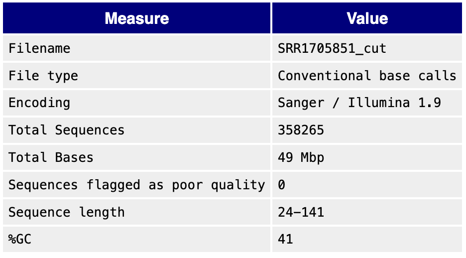 <br/>

**Per base sequence quality**

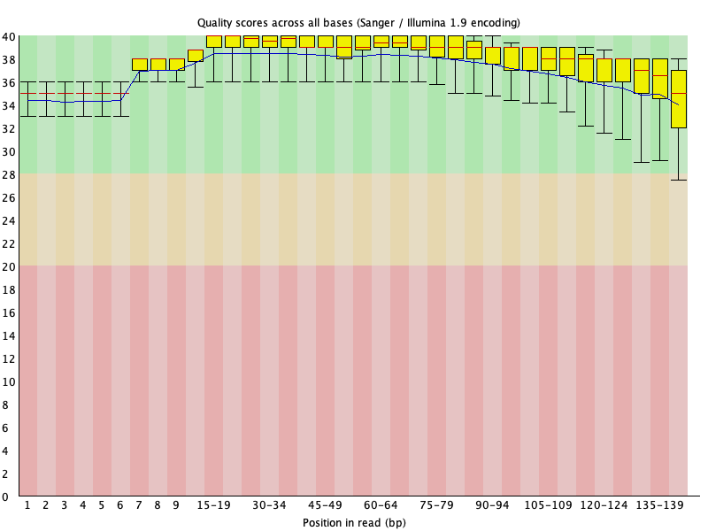 <br/>

**Per base sequence content**

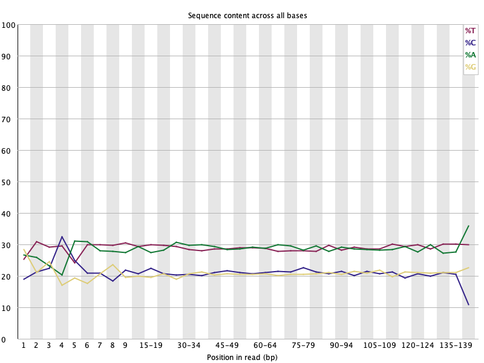

2. Aligning sequences to reference

Index the reference file 
```
bwa index KF848938.1.fasta
```

Align your reads
```
bwa mem KF848938.1.fasta SRR1705851_cut > SRR1705851_al.sam
```
Convert a sam file to a bam file
```
samtools view -S -b SRR1705851_al.sam > SRR1705851_al.bam
```
```
samtools flagstat  SRR1705851_al.bam
361154 + 0 in total (QC-passed reads + QC-failed reads)
358265 + 0 primary
0 + 0 secondary
2889 + 0 supplementary
0 + 0 duplicates
0 + 0 primary duplicates
360486 + 0 mapped (99.82% : N/A)
357597 + 0 primary mapped (99.81% : N/A)
0 + 0 paired in sequencing
0 + 0 read1
0 + 0 read2
0 + 0 properly paired (N/A : N/A)
0 + 0 with itself and mate mapped
0 + 0 singletons (N/A : N/A)
0 + 0 with mate mapped to a different chr
0 + 0 with mate mapped to a different chr (mapQ>=5)
```

Sort and index BAM file
```
samtools sort SRR1705851_al.bam -o SRR1705851_al_sorted.bam
samtools index SRR1705851_al_sorted.bam
```

Open in IGV
IGV: 
1. Select Genomes 
2. Load genome from file and select our reference genome
3. Select File
4. Open from file 
5. Select your BAM file
6. Explore the visualization.

Variant calling
```
samtools mpileup -d 0 -f KF848938.1.fasta SRR1705851_al_sorted.bam > my.mpileup
```

```
varscan mpileup2snp my.mpileup --min-var-freq 0.001 --variants --strand-filter 0 --output-vcf 1 > VarScan_results0001.vcf 
Only SNPs will be reported
Warning: No p-value threshold provided, so p-values will not be calculated
Min coverage:	8
Min reads2:	2
Min var freq:	0.001
Min avg qual:	15
P-value thresh:	0.01
Reading input from my.mpileup
1665 bases in pileup file
12 variant positions (10 SNP, 2 indel)
0 were failed by the strand-filter
10 variant positions reported (10 SNP, 0 indel)
```

And find with frequency 0.95
```
varscan mpileup2snp my.mpileup --min-var-freq 0.95 --variants --strand-filter 0 --output-vcf 1 > VarScan_results095.vcf
Only SNPs will be reported
Warning: No p-value threshold provided, so p-values will not be calculated
Min coverage:	8
Min reads2:	2
Min var freq:	0.95
Min avg qual:	15
P-value thresh:	0.01
Reading input from my.mpileup
1665 bases in pileup file
5 variant positions (5 SNP, 0 indel)
0 were failed by the strand-filter
5 variant positions reported (5 SNP, 0 indel)
```

Load reference sequences for comparison
```
wget http://ftp.sra.ebi.ac.uk/vol1/fastq/SRR170/008/SRR1705858/SRR1705858.fastq.gz
wget http://ftp.sra.ebi.ac.uk/vol1/fastq/SRR170/009/SRR1705859/SRR1705859.fastq.gz
wget http://ftp.sra.ebi.ac.uk/vol1/fastq/SRR170/000/SRR1705860/SRR1705860.fastq.gz
```

Unpack the readings
```
gunzip SRR1705859.fastq.gz SRR1705858.fastq.gz SRR1705860.fastq.gz
```

Create fastq reports
```
fastqc -o . SRR1705858.fastq 
fastqc -o . SRR1705859.fastq 
fastqc -o . SRR1705860.fastq 
```

Trim reads
```
trimmomatic SE -phred33 SRR1705858.fastq SRR1705858_cut LEADING:20 TRAILING:20 MINLEN:20 HEADCROP:10
trimmomatic SE -phred33 SRR1705859.fastq SRR1705859_cut LEADING:20 TRAILING:20 MINLEN:20 HEADCROP:10
trimmomatic SE -phred33 SRR1705860.fastq SRR1705860_cut LEADING:20 TRAILING:20 MINLEN:20 HEADCROP:10
```

Align reads
```
bwa mem KF848938.1.fasta SRR1705858_cut > SRR1705858_al.sam
bwa mem KF848938.1.fasta SRR1705859_cut > SRR1705859_al.sam
bwa mem KF848938.1.fasta SRR1705860_cut > SRR1705860_al.sam
```


```
samtools view -S -b SRR1705858_al.sam > SRR1705858_al.bam
samtools view -S -b SRR1705859_al.sam > SRR1705859_al.bam
samtools view -S -b SRR1705860_al.sam > SRR1705860_al.bam
```
```
samtools sort SRR1705858_al.bam -o SRR1705858_al_sorted.bam
samtools index SRR1705858_al_sorted.bam
samtools sort SRR1705859_al.bam -o SRR1705859_al_sorted.bam
samtools index SRR1705859_al_sorted.bam
samtools sort SRR1705860_al.bam -o SRR1705860_al_sorted.bam
samtools index SRR1705860_al_sorted.bam
```
```
samtools mpileup -d 0 -f KF848938.1.fasta SRR1705858_al_sorted.bam > my58.mpileup
samtools mpileup -d 0 -f KF848938.1.fasta SRR1705859_al_sorted.bam > my59.mpileup
samtools mpileup -d 0 -f KF848938.1.fasta SRR1705860_al_sorted.bam > my60.mpileup
```
```
varscan mpileup2snp my58.mpileup --min-var-freq 0.001 --variants --strand-filter 0 --output-vcf 1 > VarScan58_results0001.vcf 
varscan mpileup2snp my59.mpileup --min-var-freq 0.001 --variants --strand-filter 0 --output-vcf 1 > VarScan59_results0001.vcf 
varscan mpileup2snp my60.mpileup --min-var-freq 0.001 --variants --strand-filter 0 --output-vcf 1 > VarScan60_results0001.vcf 
```

Checking for the absence of SNP in control
```
varscan mpileup2snp my58.mpileup --min-var-freq 0.3 --variants --strand-filter 0 --output-vcf 1 > VarScan58_results03.vcf 
Min var freq:	0.3
Reading input from my58.mpileup
1665 bases in pileup file
0 variant positions (0 SNP, 0 indel)

varscan mpileup2snp my59.mpileup --min-var-freq 0.3 --variants --strand-filter 0 --output-vcf 1 > VarScan59_results03.vcf 
Min var freq:	0.3
Reading input from my59.mpileup
1665 bases in pileup file
0 variant positions (0 SNP, 0 indel)

varscan mpileup2snp my60.mpileup --min-var-freq 0.3 --variants --strand-filter 0 --output-vcf 1 > VarScan60_results03.vcf 
Min var freq:	0.3
Reading input from my60.mpileup
1665 bases in pileup file
0 variant positions (0 SNP, 0 indel)
```
None of the tests detected these variants as true SNPs (>30%).

To check whether the substitution is a rare variant or a sequencing artifact, you can first check it manually.

`KF848938.1:72`: SNP, occurs only in the experiment with a frequency of 0.95.

`KF848938.1:117`: SNP, occurs only in the experiment with a frequency of 0.95.

<div style="display: flex; gap: 10px; align-items: center;">
    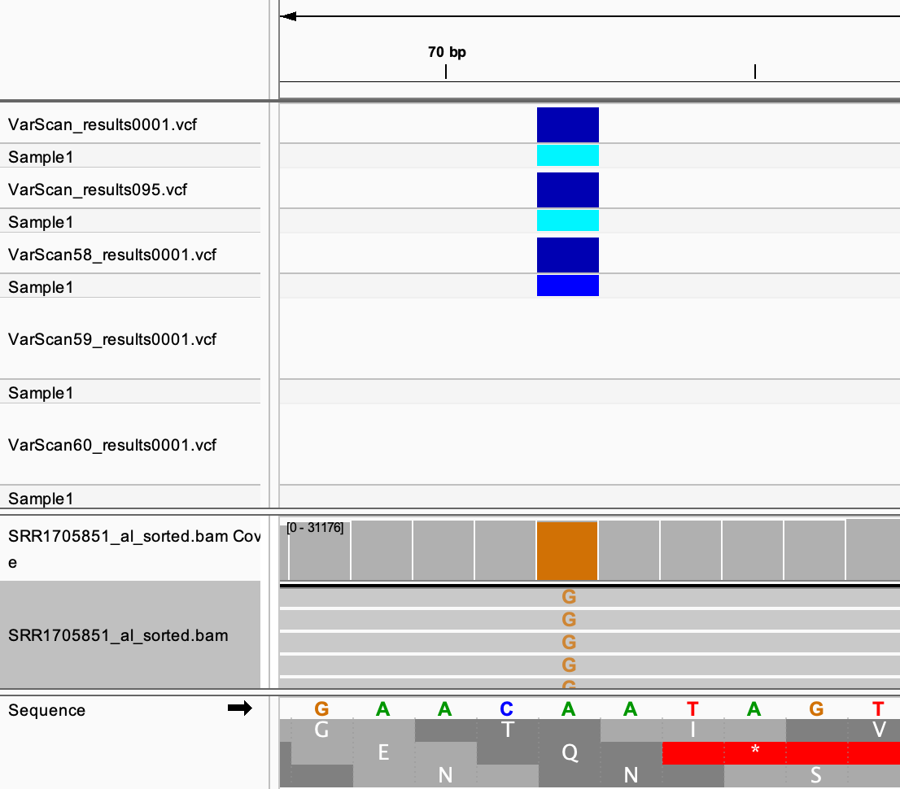
    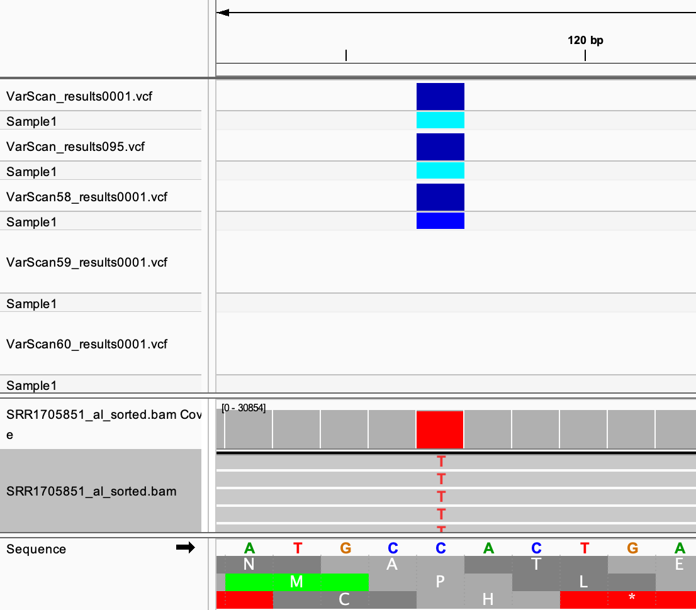
</div>

<br/>

`KF848938.1:307`: Rare variant or sequencing artifact.

`KF848938.1:389`: Rare variant or sequencing artifact.

<div style="display: flex; gap: 10px; align-items: center;">
    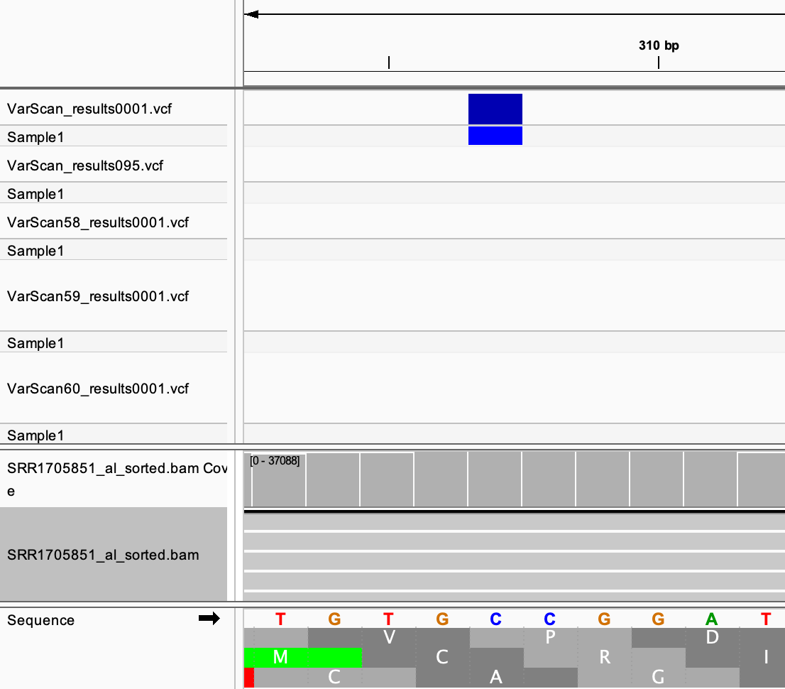
    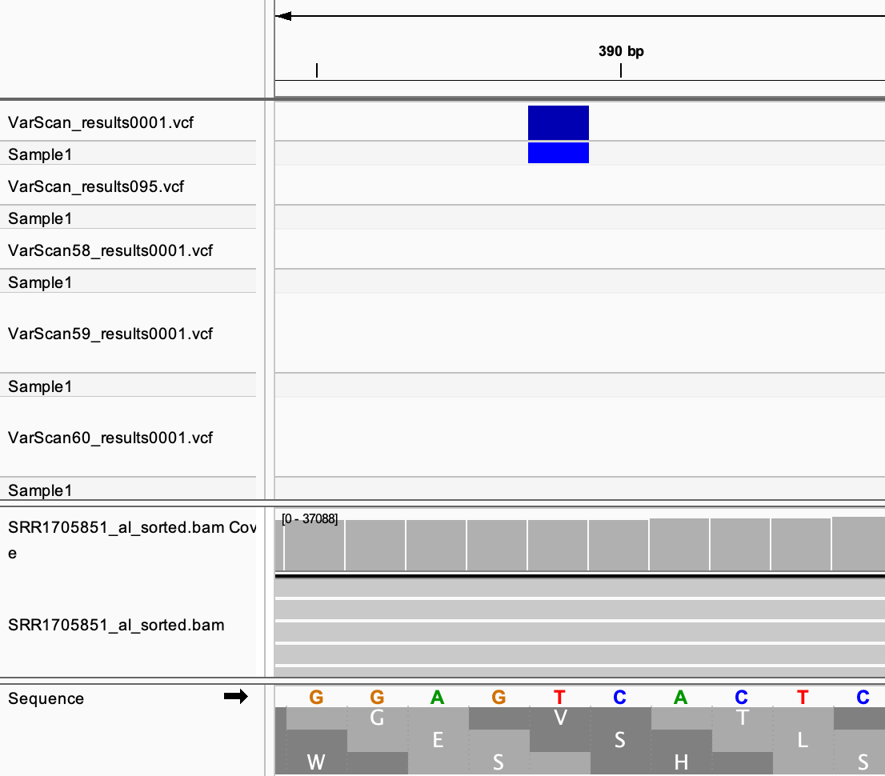
</div>

<br/>

`KF848938.1:722`: Rare variant or sequencing artifact.

`KF848938.1:774`: Occurs only in one control (58) as a sequencing artifact, but is a replacement with a frequency of 0.95 in the experiment.


<div style="display: flex; gap: 10px; align-items: center;">
    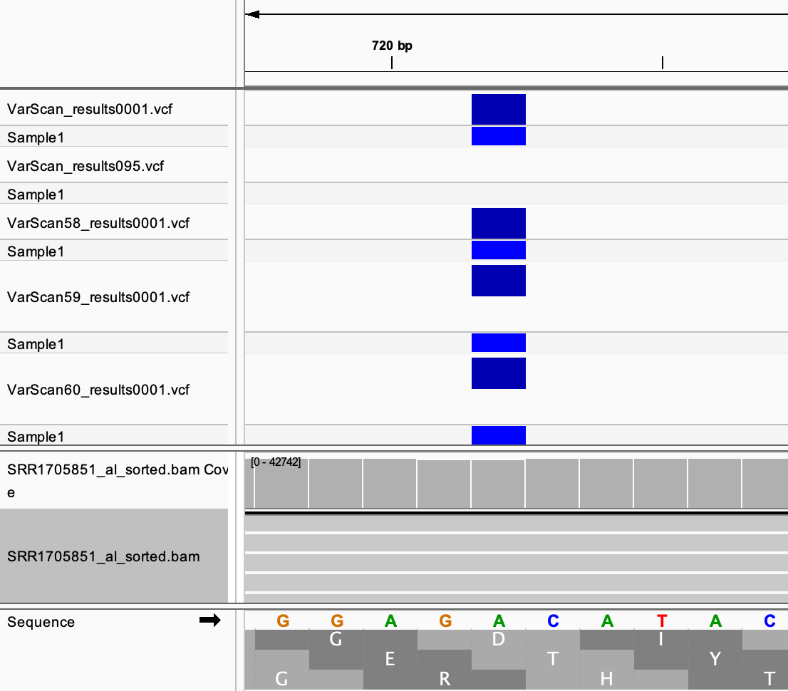
    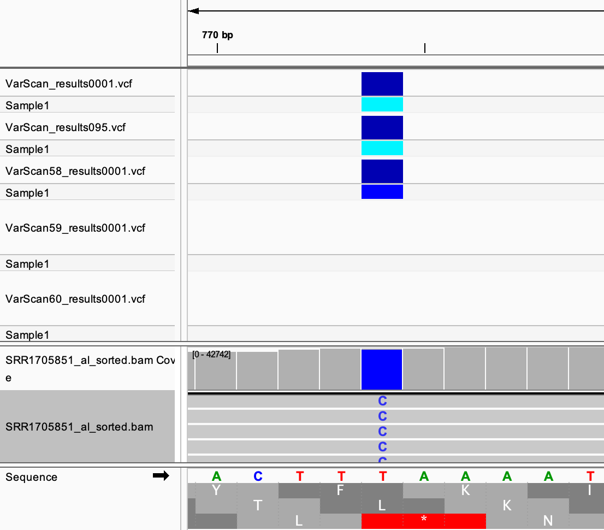
</div>
<br/>

`KF848938.1:802`: Rare variant or sequencing artifact.

`KF848938.1:999`: Occurs only in the test sample, with a frequency of 0.95. Is an SNP.

<div style="display: flex; gap: 10px; align-items: center;">
    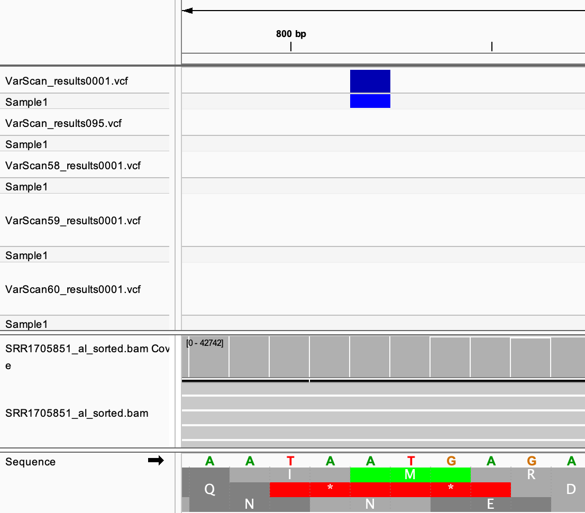
    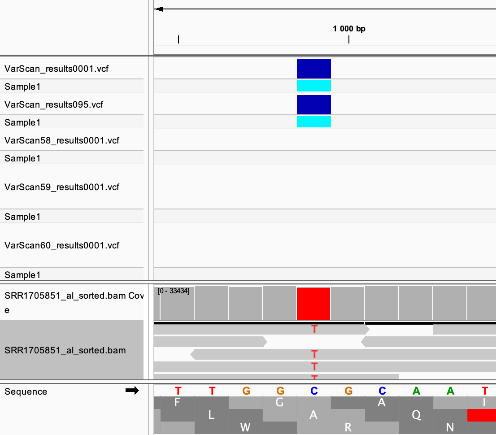
</div>
<br/>

`KF848938.1:1260`: Occurs only in one control (58) as a sequencing artifact, but is a replacement with a frequency of 0.95 in the experiment.

`KF848938.1:1458`: A rare variant or sequencing artifact.

<div style="display: flex; gap: 10px; align-items: center;">
    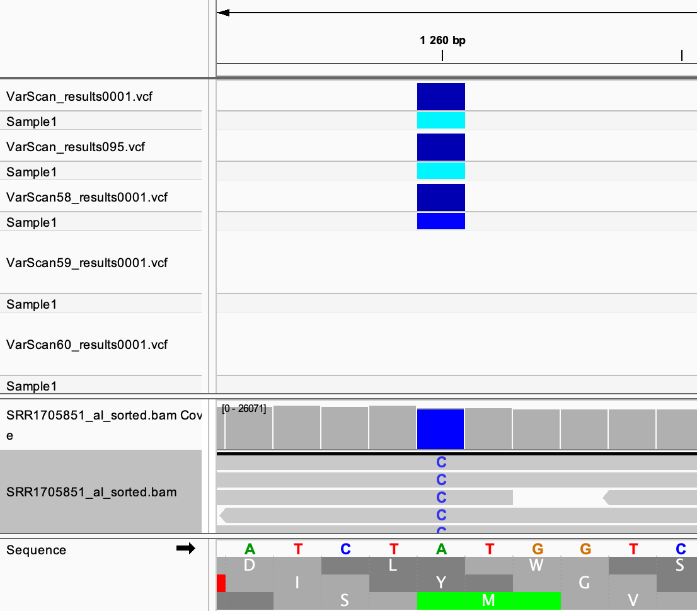
    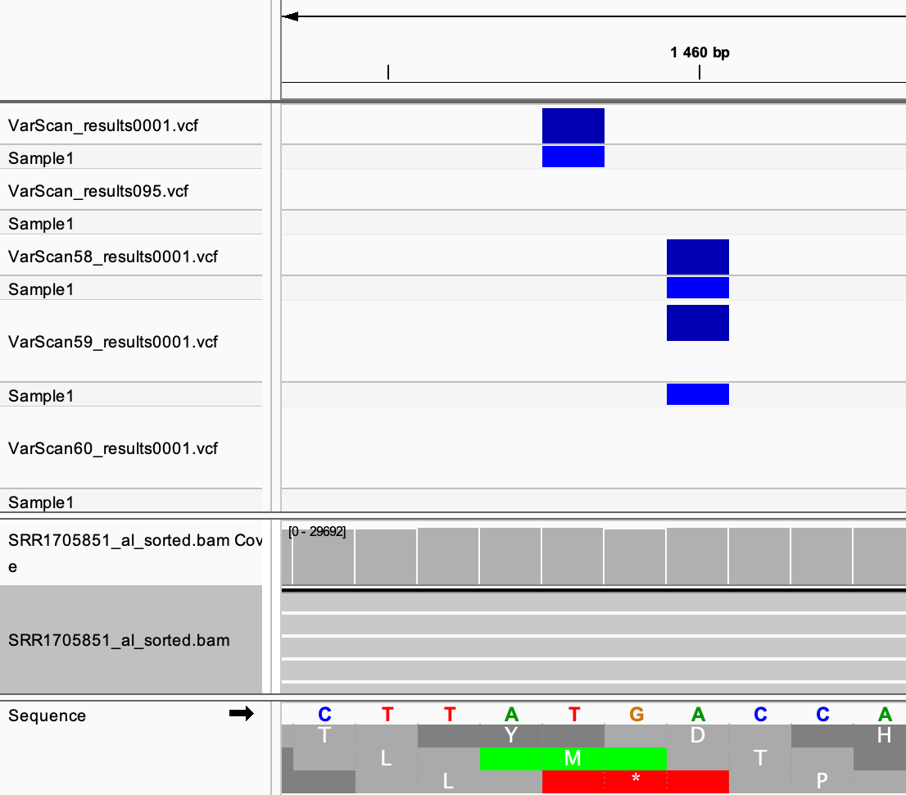
</div>
<br/>


When it may do automatically.
To count mean and std of frequency for rare variants we used snp_filter script from this repository.

Input
```
VarScan_results0001.vcf
VarScan58_results0001.vcf
VarScan59_results0001.vcf
VarScan60_results0001.vcf
```

Output
```
Filtered values that exceed the mean of std deviations:
  Position Ref Alt  Freq
0      307   C   T   0.8
1     1458   T   C   0.7

Summary of Means and Standard Deviations:
VarScan58_results0001.vcf: Mean = 0.2600, Std = 0.0542
VarScan59_results0001.vcf: Mean = 0.2172, Std = 0.0280
VarScan60_results0001.vcf: Mean = 0.2267, Std = 0.0285

Mean = 0.2346, Std = 0.0369 
Mean + Std * 3 = 0.3454
```